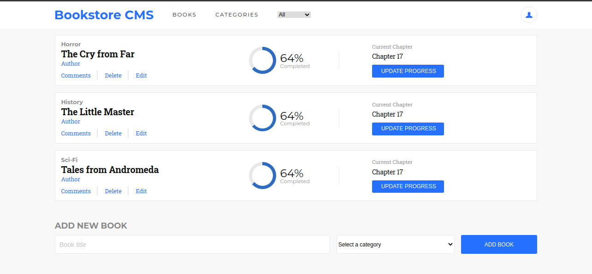

# Bookstore

>This is a simple bookstore app created using the react-redux library.  
>This is the second milestone of the project where I have added redux and displayed some books as the initial state of the app.  
>The main objective of this assignment is to learn about redux state management library.
<div align="center">

[](https://github.com/praz99/bookstore)
[](https://github.com/praz99/bookstore/issues)
[](https://github.com/praz99/bookstore/pulls)

</div>

## 📝 Contents

<p align="center">
<a href="#with">Built with</a>&nbsp;&nbsp;&nbsp;|&nbsp;&nbsp;&nbsp;
<a href="#ll">Live Demo Link</a>&nbsp;&nbsp;&nbsp;|&nbsp;&nbsp;&nbsp;
<a href="#gs">Getting started</a>&nbsp;&nbsp;&nbsp;|&nbsp;&nbsp;&nbsp;
<a href="#author">Author</a>
</p>

## 🔧 Built with<a name = "with"></a>
- ReactJS
- React-Redux
- HTML 5 and CSS 3



## Live Demo Link <a name = "ll"></a>

[See Live](https://praz-bookstore.herokuapp.com/)


## Getting Started <a name = "gs"></a>

This project was bootstrapped with [Create React App](https://github.com/facebook/create-react-app).

To get a local copy of the repository please run the following commands on your terminal:

```
$ git clone git@github.com:praz99/bookstore.git
```
```
$ cd bookstore
```

```
$ yarn install
```
```
$ yarn start
```

This runs the app in the development mode.
Open [http://localhost:3000](http://localhost:3000) to view it in the browser.
## ✒️  Authors <a name = "author"></a>

👤 **Prajwal Thapa**

- Github: [praz99](https://github.com/praz99)
- Twitter: [@thapa_praz](https://twitter.com/thapa_praz)
- LinkedIn: [prazwal-thapa](https://linkedin.com/in/prazwal-thapa)
- Email: t.prazwal@gmail.com

## 🤝 Contributing

Contributions, issues and feature requests are welcome!

Feel free to check the [issues page](https://github.com/praz99/bookstore/issues).


## 👍 Show your support

Give a ⭐️ if you like this project!

## :clap: Acknowledgements

- [Microverse](https://www.microverse.org/)

## 📝 License

This project is [MIT](./LICENSE) licensed.
